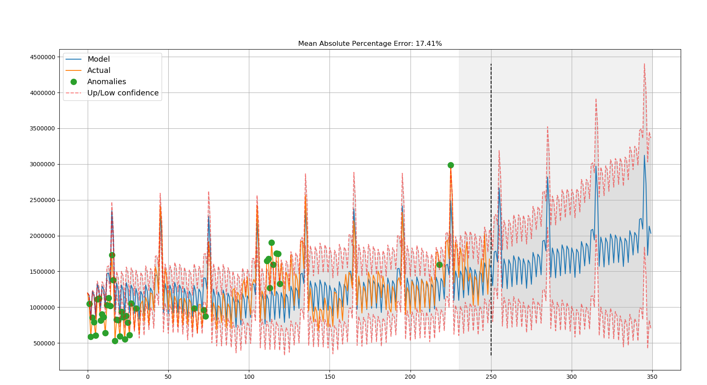
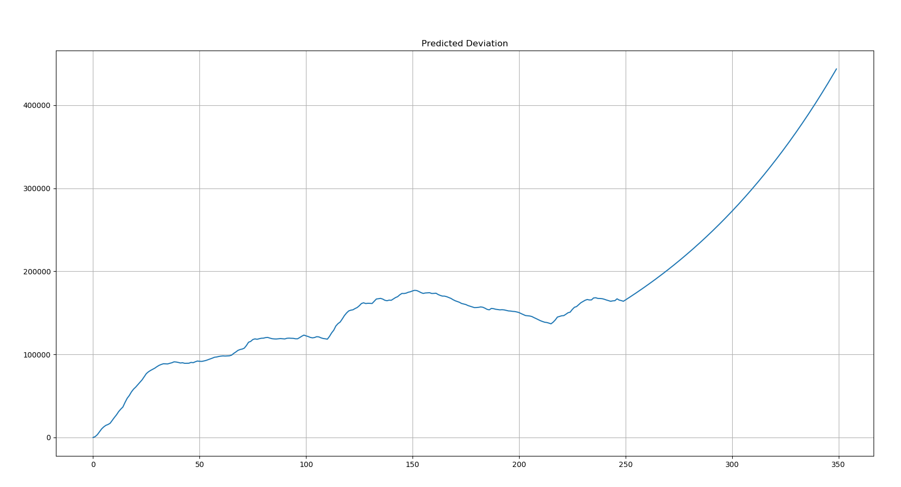

# time-series-prediction
This project implements the Holt-Winters model(Triple exponential smoothing)
二次指数平滑，保留平滑信息和趋势信息
三次指数平滑法，添加第三个量描述季节性(累加式季节性或者累乘式季节性)
#### Example
<pre><code>
python  time_series.py	
</pre></code>
<table> <tbody> <tr> <td align="left" width=450>
Mean Absolute Percentage Error 
</a></td>
<td align="left" width=450>
Predicted Deviation 
</a></td>
</td></tr></tbody></table>

#### Application
监控告警
<pre><code>

	currency = pd.read_csv('currency.csv', index_col=['Time'], parse_dates=['Time'])
    data = currency.GEMS_GEMS_SPENT[:-50]
    slen = 30 
	'''
	slen季节性参数，currency数据(每天一个点)季节性是月，即30天
	slen 即为周期数的点数，如果周期数为30天，30天采点为N个点，那么slen即为N
	n_preds 为预测接下来多少数据，单位为采点间隔时间
	比如一天采一次点，n_preds为N，那么就是预测接下来N天的数据
	'''
    x = [0, 0, 0]
	'''
    opt = minimize(time_series_cv_score, x0 = x,
                  args = (data, mean_absolute_percentage_error, slen),
                   method = "TNC", bounds = ((0, 1), (0, 1), (0, 1)) )
    alpha_final, beta_final, gamma_final = opt.x
	'''
    model = HoltWinters(data, slen = slen,
                        alpha = 0,
                        beta = 0,
                        gamma = 0,
                        n_preds = 100, scaling_factor = 3)

    alpha_final, beta_final, gamma_final = model.get_best_parameters()
    print(alpha_final, beta_final, gamma_final)
	'''
	model.triple_exponential_smoothing()
	'''
    model.triple_exponential_smoothing(plot_results=True, plot_predicted_deviation=True,
                                       plot_intervals=True, plot_anomalies=True)

    result =  model.result
    print(len(result), len(data))
    print(model.upper_bond[340:])
    print(result[340:])
    print(model.lower_bond[340:]) 
	
	'''
	告警时：
	1. 模型训练
	2. 预测未来n_preds个点，存放在内存
	3. 获取实际第i个点数据
	4. 判断是否在[model.lower_bond[i], model.upper_bond[i]]区间内，不是则告警
	
	'''
</pre></code>

#### Reference
* [mlcourse.ai](https://github.com/Yorko/mlcourse.ai/tree/master/data) 
* [Open Machine Learning Course. Topic 9. Part 1. Time series analysis in Python](https://medium.com/open-machine-learning-course/open-machine-learning-course-topic-9-time-series-analysis-in-python-a270cb05e0b3).  Chinese: [href_1](https://zhuanlan.zhihu.com/p/43601077), [href_2](https://mp.weixin.qq.com/s?__biz=MzI3ODkxODU3Mg==&mid=2247487237&idx=1&sn=df2c2793489b55c3ff13618b53e07533&chksm=eb4eebc6dc3962d0ae811a93faf65b0abe6af9b613cd821b14dd15cb355a247a56a2bea7078d&token=574744471&lang=zh_CN#rd) 
* [torchlite](https://github.com/EKami/Torchlite/blob/master/torchlite/pandas/time_series.py)
